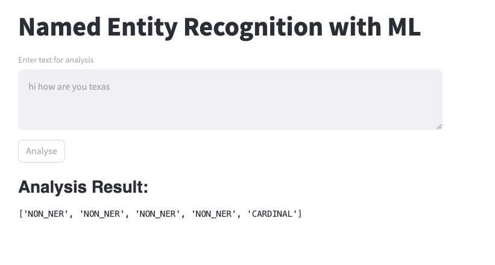

# NERC Model Visualization with Streamlit



## Overview

This project demonstrates the visualization of Named Entity Recognition and Classification (NERC) model predictions using Streamlit. The model predicts entities in text and displays the results in an interactive web interface.

## Prerequisites

Before running the Streamlit project, ensure you have the following installed:

- Python 3.11
- virtualenv (for creating a virtual environment)

## Setup

1. Clone the repository:

    ```bash
    git clone https://github.com/your_username/your_project.git
    cd your_project/Visualization
    ```

2. Create a virtual environment:

    ```bash
    python3.11 -m venv myVersion
    ```

3. Activate the virtual environment:

    ```bash
    source myVersion/bin/activate
    ```

4. Install the required dependencies:

    ```bash
    pip install -r requirements.txt
    ```

## Downloading the Model

To use the NERC model, download it by running:

```bash
python save_model.py
```

This script will download the model from Google Drive and save it locally.

## Running the Streamlit Project
After downloading the model, run the Streamlit project:

```bash
streamlit run streamlit_demo.py
```

This will start a local development server, and you can access the visualization interface by visiting http://localhost:8501 in your web browser.
